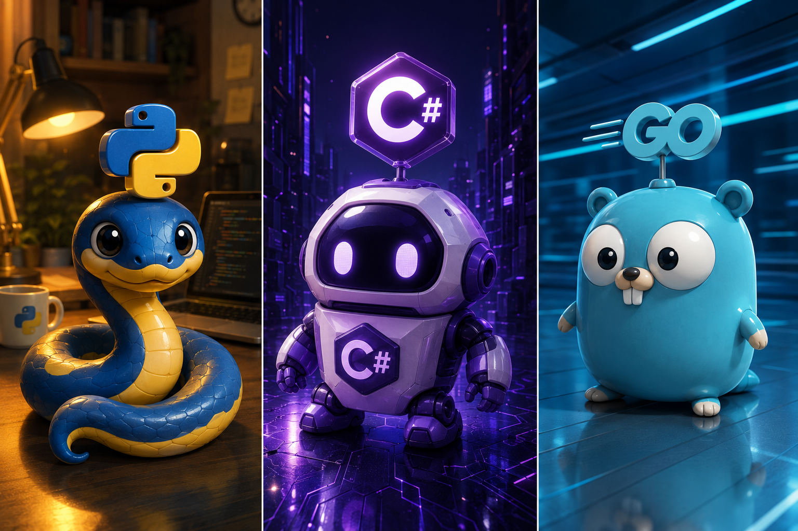

<!--Title-->

  

<!--
<h2 align="center">😎 Profile 😎</h2>
 
-->

<h2 align="center">✨ 물개 ✨</h2>
 

<h3 align="center">최애 언어</h3>
 
<table align="center">
  <tr>
    <td align="center" width="150">
      
        
      <b>Python</b>
    </td>
    <td align="center" width="150">
      
       
      <b>C#</b>
    </td>
    <td align="center" width="150">
      
       
      <b>GO</b>
    </td>
  </tr>
  <tr>
    <td colspan="5" align="center">
      
    </td>
  </tr>
</table>

  

<h3 align="center">취급목록</h3>
<table align="center">
  <tr>
    <td align="center" width="84"></td>
    <td align="center" width="84"></td>
    <td align="center" width="84"></td>
    <td align="center" width="84"></td>
    <td align="center" width="84"></td>
  </tr>
  <tr>
    <td align="center" width="84"></td>
    <td align="center" width="84"></td>
    <td align="center" width="84"></td>
     <td align="center" width="84"></td>
    <td align="center" width="84"></td>
  </tr>
  <tr>
    <td align="center" width="84"></td>
    <td align="center" width="84"></td>
    <td align="center" width="84"></td>
    <td align="center" width="84"></td>
    <td align="center" width="84"></td>
  </tr>
  <tr>
    <td align="center" width="84"></td>
    <td align="center" width="84"></td>
    <td align="center" width="84"></td>
    <td align="center" width="84"></td>
    <td align="center" width="84"></td>
  </tr>
</table>

  

